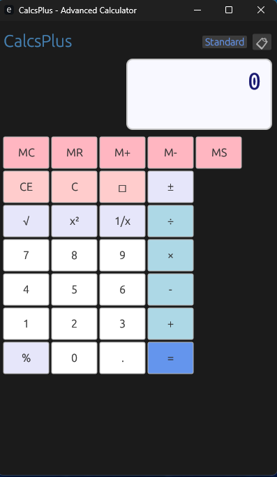

# CalcsPlus - Advanced Calculator

CalcsPlus is an elegant and feature-rich calculator application built in Rust using the eframe/egui GUI framework. It provides both standard and scientific calculation modes with a classical Windows Calculator-inspired design.



## Features

### Standard Mode
- Basic arithmetic operations (+, -, ×, ÷)
- Memory functions (MC, MR, M+, M-, MS)
- Square root, square, reciprocal, and percentage calculations
- Clear entry (CE), clear all (C), and backspace functionality
- Sign toggle (±)

### Scientific Mode
- All standard mode features
- Trigonometric functions (sin, cos, tan)
- Logarithmic functions (log, ln)
- Power operations (x², x^y)
- Factorial calculations (n!)
- Advanced mathematical operations

### Additional Features
- Calculation history with scrollable panel
- Memory indicator when values are stored
- Error handling for invalid operations
- Elegant, classical GUI design
- Responsive layout that adapts to window resizing

## Installation

### Prerequisites
- Rust (latest stable version)
- Cargo (comes with Rust)

### Building from Source
1. Clone or download this repository
2. Navigate to the project directory
3. Run the following command:

```bash
cargo build --release
```

### Running the Application
```bash
cargo run
```

## Usage

### Basic Operations
1. Enter numbers using the number buttons (0-9)
2. Use the decimal point (.) for decimal numbers
3. Select an operation (+, -, ×, ÷)
4. Enter the second number
5. Press = to calculate the result

### Mode Switching
- Click the "Standard" or "Scientific" button in the top-right to switch between modes

### Memory Functions
- **MC**: Clear memory
- **MR**: Recall memory value
- **M+**: Add current display to memory
- **M-**: Subtract current display from memory
- **MS**: Store current display in memory

### History
- Click the 📋 button to toggle the calculation history panel
- View your recent calculations in a scrollable list

## Architecture

The application is structured into several modules:

- `main.rs`: Application entry point and window configuration
- `app.rs`: Core application state and logic
- `calculator.rs`: Mathematical operations and calculation engine
- `ui.rs`: User interface rendering and event handling

## Dependencies

- `eframe`: Cross-platform GUI framework
- `egui`: Immediate mode GUI library
- `serde`: Serialization framework for settings persistence

## License

This project is open source. Feel free to use, modify, and distribute as needed.

## Contributing

Contributions are welcome! Please feel free to submit issues, feature requests, or pull requests.

